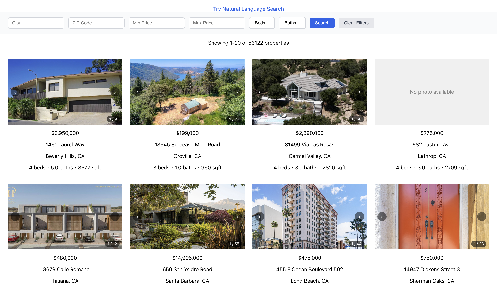

# IDX Exchange Property Search Application

A Zillow-style property search application built on real MLS/RETS data, developed as part of the IDX Exchange Software Development Internship. Users can search, filter, and browse property listings with photo galleries, interactive maps, open house information, and natural-language search.



## Table of Contents
- [Tech Stack](#tech-stack)
- [Local Setup](#local-setup)
- [Project Structure](#project-structure)
- [API Reference](#api-reference)
- [Database Schema](#database-schema)
- [Known Issues & Future Improvements](#known-issues--future-improvements)

## Tech Stack

**Backend**
- Node.js + Express `^5.2.1`
- MySQL 8 (via Docker), `mysql2` `^3.22.5`
- `@anthropic-ai/sdk` `^0.116.0` (Claude `claude-haiku-4-5`, for natural language search)
- `dotenv` `^17.4.2`, `cors` `^2.8.6`
- Testing: `jest` `^30.4.2`, `supertest` `^7.2.2`

**Frontend**
- React `^19.2.7`
- React Router `^6.21.3` — **intentionally pinned**, not the latest major version. `react-router-dom` v7 is incompatible with Create React App's Jest configuration; upgrading will break the test suite. Do not bump this without also migrating off `react-scripts`.
- Create React App (`react-scripts` `5.0.1`)
- Testing: React Testing Library (`@testing-library/react` `^16.3.2`)
- Google Maps Embed API (iframe-based, no npm package)

**Infrastructure**
- Docker (MySQL container)
- Git + GitHub, feature-branch workflow with PR reviews

## Local Setup

### Prerequisites
- Node.js and npm
- Docker Desktop
- A free [Anthropic Console](https://console.anthropic.com) account (for natural language search — new accounts include free credits, and typical development usage costs a fraction of a cent per request)
- A [Google Cloud](https://console.cloud.google.com) project with the **Maps Embed API** enabled, and an API key restricted to that API + `localhost:3000`

### 1. Clone the repository
```bash
git clone https://github.com/hjtan03/idx-exchange-sde.git
cd idx-exchange-sde
```

### 2. Start the database
```bash
docker run -d \
  --name idx-mysql-local \
  -p 3306:3306 \
  -e MYSQL_ROOT_PASSWORD=<your_password> \
  -e MYSQL_DATABASE=rets \
  mysql:8
```
Import the provided `rets_property.sql` and `rets_openhouse.sql` dumps into the `rets` database:
```bash
docker exec -i idx-mysql-local mysql -u root -p<your_password> rets < rets_property.sql
docker exec -i idx-mysql-local mysql -u root -p<your_password> rets < rets_openhouse.sql
```
Then apply the additional indexes added in Week 9:
```bash
docker exec -i idx-mysql-local mysql -u root -p<your_password> rets < backend/sql/proposed_indexes.sql
```
(These raw data files and the fresh-data FTP credentials are provided separately by your team lead — they are not included in this repository, and should never be committed.)

### 3. Configure and start the backend
```bash
cd backend
npm install
```
Create `backend/.env`:
```env
DB_HOST=localhost
DB_PORT=3306
DB_USER=root
DB_PASSWORD=<your_password>
DB_NAME=rets
PORT=5001
ANTHROPIC_API_KEY=<your_anthropic_api_key>
```
```bash
npm run dev
```
Verify it's running: `curl http://localhost:5001/api/health` should return `{"status":"ok","database":"connected"}`.

### 4. Configure and start the frontend
```bash
cd ../frontend
npm install
```
Create `frontend/.env`:
```env
REACT_APP_GOOGLE_MAPS_API_KEY=<your_google_maps_api_key>
```
```bash
npm start
```
The app runs at `http://localhost:3000` and proxies `/api/*` requests to the backend at `http://localhost:5001`.

### 5. Run tests
```bash
# Backend (from repo root)
cd backend && npm test

# Frontend (from repo root - cd .. first if you're still inside backend/)
cd ../frontend && npm test -- --watchAll=false
```

## Project Structure

```
idx-exchange-sde/
├── backend/
│   ├── index.js              # Express app entry point, middleware, health check
│   ├── db.js                 # MySQL connection pool
│   └── routes/
│       ├── properties.js     # Property search, detail, and open house endpoints
│       └── search.js         # Natural language search endpoint
└── frontend/src/
    ├── api/
    │   └── client.js         # API client functions (fetchProperties, etc.)
    ├── components/
    │   ├── PropertyCard.js
    │   ├── PropertyFilters.js
    │   ├── Pagination.js
    │   ├── PropertyImageCarousel.js
    │   ├── PropertyImageGallery.js
    │   ├── PropertyMap.js
    │   ├── OpenHouseList.js
    │   └── ErrorBoundary.js
    ├── pages/
    │   ├── ListingsPage.js
    │   ├── PropertyDetailPage.js
    │   └── NaturalSearchPage.js
    ├── hooks/
    └── utils/
        └── parsePhotos.js     # Defensive L_Photos JSON parsing
```

## API Reference

### `GET /api/health`
Health check — verifies database connectivity.
```bash
curl http://localhost:5001/api/health
```
```json
{"status":"ok","database":"connected"}
```

### `GET /api/properties`
Paginated, filterable property search.

**Query parameters:** `limit` (default 20, max 100), `offset` (default 0), `city`, `zipcode`, `minPrice`, `maxPrice`, `beds` (minimum, not exact), `baths` (minimum, not exact), `minYearBuilt`, `maxYearBuilt`

```bash
curl "http://localhost:5001/api/properties?city=Beverly%20Hills&beds=4&maxPrice=4000000"
```
```json
{
  "total": 20,
  "limit": 20,
  "offset": 0,
  "results": [
    {
      "id": 53,
      "L_ListingID": "1118422731",
      "L_Address": "1461 Laurel Way",
      "L_City": "Beverly Hills",
      "L_Zip": "90210",
      "L_SystemPrice": 3950000,
      "L_Keyword2": 4,
      "LM_Dec_3": "5.0",
      "YearBuilt": 1973
    }
  ]
}
```
*Real responses include the full ~90-field MLS schema per property; trimmed above for readability.*

### `GET /api/properties/:id`
Single property lookup by `L_ListingID`.

```bash
curl http://localhost:5001/api/properties/1077426281
```
Returns the full property object (id, `L_ListingID`, `L_Address`, `L_City`, `L_State`, `L_Zip`, `L_SystemPrice`, `L_Keyword2` [beds], `LM_Dec_3` [baths], `YearBuilt`, `L_Photos` [JSON-string array of photo URLs], plus ~90 other MLS fields).

Unknown ID:
```json
{"error": "Property not found"}
```

### `GET /api/properties/:id/openhouses`
Open house events for a property, ordered by date and start time. Returns `[]` if the property exists with no scheduled open houses, and `404` if the property itself doesn't exist.

```bash
curl http://localhost:5001/api/properties/1088763330/openhouses
```
```json
[
  {
    "id": 2962,
    "L_ListingID": "1088763330",
    "L_DisplayId": "1088763330",
    "OpenHouseDate": "2026-07-10T05:00:00.000Z",
    "OH_StartTime": "10:00:00",
    "OH_EndTime": "14:00:00",
    "OH_StartDate": "2026-07-10T05:00:00.000Z",
    "OH_EndDate": "2026-07-10T05:00:00.000Z",
    "all_data": "{...raw MLS JSON blob, returned as-is...}",
    "updated_date": "2026-06-02T06:08:34.000Z",
    "up_date": "2026-06-16T13:27:05.000Z",
    "API_OH_StartDate": "2026-07-10 10:00:00",
    "API_OH_EndDate": "2026-07-10 14:00:00"
  }
]
```
*Example above reflects a listing with a scheduled open house at the time of writing — dates will differ or return `[]` depending on current data.*
`all_data` is a raw JSON string returned as-is — fields like `OpenHouseRemarks` are extracted from it on the frontend, not the backend.

### `POST /api/search/natural`
Converts a plain-English query into structured filters via Claude, then runs the same search logic as `GET /api/properties`.

```bash
curl -X POST http://localhost:5001/api/search/natural \
  -H "Content-Type: application/json" \
  -d '{"query": "3 bed house in Beverly Hills under $4 million"}'
```
```json
{
  "results": [
    {
      "id": 158656,
      "L_ListingID": "1154471367",
      "L_Address": "132 S Maple Drive 101",
      "L_City": "Beverly Hills",
      "L_Zip": "90212",
      "L_SystemPrice": 1679000,
      "L_Keyword2": 3,
      "LM_Dec_3": "3.0",
      "YearBuilt": 2002
    }
  ],
  "interpretedFilters": {
    "city": "Beverly Hills",
    "maxPrice": 4000000,
    "beds": 3
  }
}
```
`beds` is interpreted as a minimum, consistent with `GET /api/properties` semantics — results may include properties with more than the requested bed count. Filters the query doesn't mention (e.g. `minPrice` here) are omitted rather than guessed.

## Database Schema

**`rets_property`** (~53,122 rows) — property listings.
| Column | Meaning |
|---|---|
| `id` | Internal auto-increment primary key |
| `L_ListingID` | External MLS listing ID (indexed, not unique — used as the `:id` route param) |
| `L_Address`, `L_City`, `L_State`, `L_Zip` | Location |
| `L_SystemPrice` | List price |
| `L_Keyword2` | Bedroom count |
| `LM_Dec_3` | Bathroom count |
| `L_Photos` | JSON-string array of photo URLs (may be null, empty, or malformed — parsed defensively) |
| `YearBuilt` | Year built |

Indexes: `idx_L_ListingID`, `idx_L_City`, `idx_L_Zip`, `idx_L_DisplayId`, `idx_rets_property_type`, `ft_remarks` (fulltext), plus `idx_price`, `idx_beds`, `idx_baths`, `idx_yearbuilt`, `idx_city_price` (added Week 9).

**`rets_openhouse`** (~4,282 rows) — open house events.
| Column | Meaning |
|---|---|
| `L_ListingID` | Foreign key to `rets_property.L_ListingID` |
| `OpenHouseDate`, `OH_StartTime`, `OH_EndTime` | Scheduling |
| `all_data` | JSON blob with additional fields, including `OpenHouseRemarks` |

**Relationship:** one property can have many open house rows. Roughly 741 rows (~15–20% of listing IDs with open houses) reference a `L_ListingID` with no matching row in `rets_property` — a known data quality characteristic of the source data, not a bug. Both API endpoints handle this gracefully (404 on the missing property, no crash).

## Known Issues & Future Improvements

- **`idx_city_price` isn't used by city-filtered queries.** City matching wraps the column in `LOWER(TRIM(L_City))` for case-insensitivity, which prevents MySQL from using a plain B-tree index on it. A normalized or generated column would fix both the casing and the index usability at once.
- **`beds`/`baths` filters are minimum-count (`>=`), not exact match.** This is an intentional design decision (Weeks 6/9), not a bug — a search for "3 beds" includes 4+ bed properties.
- **ID validation on detail/open-house routes is length-only**, not format-based. Not required by the current scope, but worth tightening if malformed (non-numeric) IDs become a real concern.
- **`routes/search.js` (natural language search) has no automated Jest/Supertest coverage.** It's been manually tested and verified working, including its error paths, but isn't part of the current test suite.
- **Orphaned `rets_openhouse` records** are handled gracefully by existing endpoints, but a future "all open houses" list endpoint would need explicit filtering logic to exclude them.
- **`L_Photos` often contains authenticated Trestle/Cotality media URLs** that won't render without a live API token — this is a data source constraint, not a parsing bug. Parsing logic is fully tested and correct.

## Author
Hong-Ming Justin Tan
IDX Exchange SDE Intern